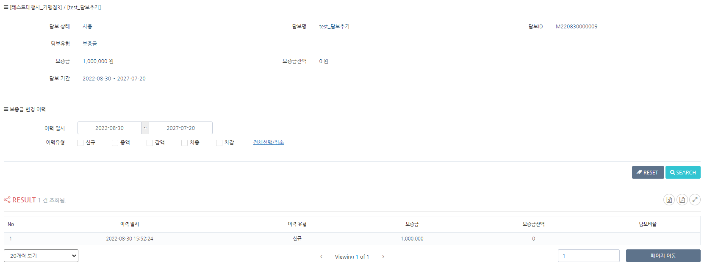

# 가맹점 담보관리

### 가맹점 담보

* 가맹점의 사용상태, 사업자번호, 지사, 대행사, 에이전시 정보를 나타냅니다.
* 담보현황 검색을 통해 해당 가맹점의 담보별 현황을 조회 할 수 있습니다.

<figure><figcaption></figcaption></figure>

### 담보현황 검색 결과

**등록일**\
.png>)\
담보 등록 일시를 초단위까지 나타냅니다.&#x20;

\
\
**담보상태**\
****.png>)\
해당 담보의 사용 상태를 나타내며 사용,담보만료로 구분됩니다.

**담보명 , 담보ID**&#x20;

.png>)\
담보명과 담보ID를 나타냅니다. 담보명 및 담보ID 클릭시 [담보별 상세정보](undefined-1.md#undefined-3) 페이지로 이동합니다.

**담보유형**

****.png>)****\
****담보 유형을 나타냅니다.&#x20;

\*담보 유형은 설정된 담보별로 표시되며 보증금, 보증보험, 정산보증금, 부분 지급 정산보증금,질권, 기타로 구분됩니다.

**담보기간**

\
설정된 담보기간을 나타냅니다.

**보증금**

.png>)\
담보유형 별로 설정된 보증금액을 나타냅니다.

**보증금잔액**

.png>)\
등록된 담보유형 별로 설정된 보증금액의 잔액을 나타냅니다.

### 참고

### 담보별 상세정보

* 가맹점의 담보유형별 상세정보 (담보상태,담보명,담보ID,담보유형,보증금,보증금잔액,담보기간)를 확인 할 수 있습니다.
* 보증금 변경이력 조회를 통해 조회기간 내 변경이력을 확인 할 수 있습니다.
* 변경이력 결과는은 신규,증액,감액,차증,차감 내역을 일자별로 리스트화되어 나타냅니다.&#x20;

<figure><figcaption></figcaption></figure>

